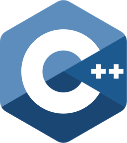

<h1 align="center">
  
</h1>

Produzido com a colaboração de integrantes da He4rt Developers, esse tutorial tem como objetivo principal apresentar e ensinar a linguagem de programação C++ de uma maneira fácil, descomplicada e acessível para todos.

## ROADMAP

### Ambiente

1. [Configurando o Ambiente](#)
1. [Instalando o Falcon C++](#)
1. [Licenças Open Source](#)

### Teoria

1. [Um pouco de teoria](#)
1. [O que é C++?](#)

### Hello World

1. [Primeiro Hello World](#)
1. [Sequência](#)
1. [Bibliotecas](#)
1. [Função main](#)
1. [Saída de Dados e Biblioteca](#)
1. [Lista de Exercícios](#)

### Introdução ao compilador

1. [Compilador](#)
1. [Vinculador](#)

### Sintaxe básica

1. [Variáveis](#)
1. [Comentários](#)
1. [Entrada de Dados com std::cin](#)
1. [Operações Matemáticas](#)
1. [std::string](#)
1. [Condições](#)
1. [Operadores Lógicos](#)
1. [Switch](#)
1. [Loops](#)
1. [Teste de Mesa](#)
1. [Vetores (C Arrays)](#)
1. [Matrizes](#)

### Funções no CPP

1. [Funções](#)
1. [Protótipo de Função](#)
1. [Argumentos da função main](#)
1. [Recursão](#)
1. [Funções Lambda](#)
1. [Keyword Static](#)

### Cabeçalho

1. [Header](#)
1. [Protetores](#)
1. [Namespace](#)

### Ponteiros

1. [Introdução a ponteiros](#)
1. [Smart Pointers](#)

### Intermediário

1. [Structs](#)
1. [Templates](#)
1. [Instâncias de Modelo de Função](#)
1. [Stack e Heap](#)
1. [Auto Keyword](#)
1. [Big O Notation](#)

### Orientação a Objetos (OOP)

1. [Introducao](#)
1. [Classes](#)
1. [Keyword public, protected e private](#)
1. [Setters e Getters](#)
1. [Inicialização de Construtores](#)
1. [Classes no Header](#)

## Autores

- **Bruno (PoorlyDefinedBehaviour)** - Developer & Member of He4rt Developers\_ - [GitHub](https://github.com/PoorlyDefinedBehaviour) - [Twitter](https://twitter.com/PoorlyDefinedBehaviour)

- **Giovane Cardoso (NovoutHe4rt)** - Developer & Member of He4rt Developers\_ - [Twitter](https://twitter.com/NovoutT)

- **Thiago Rezende (HorusHe4rt)** - Developer & Member of He4rt Developers\_ - [Twitter](https://twitter.com/HorusHe4rt)
