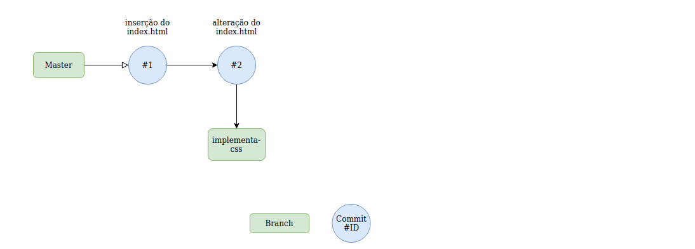
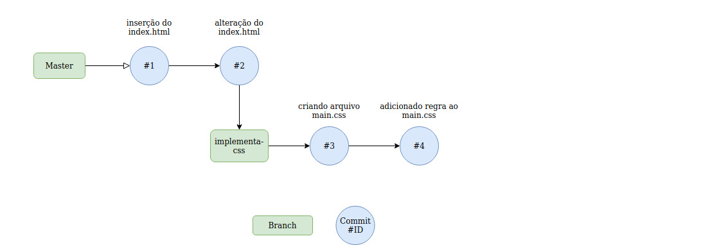
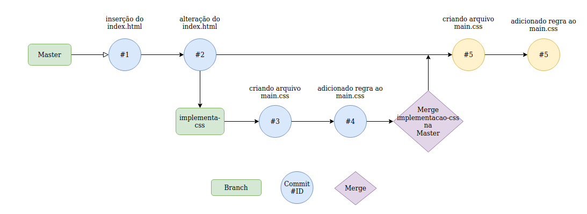
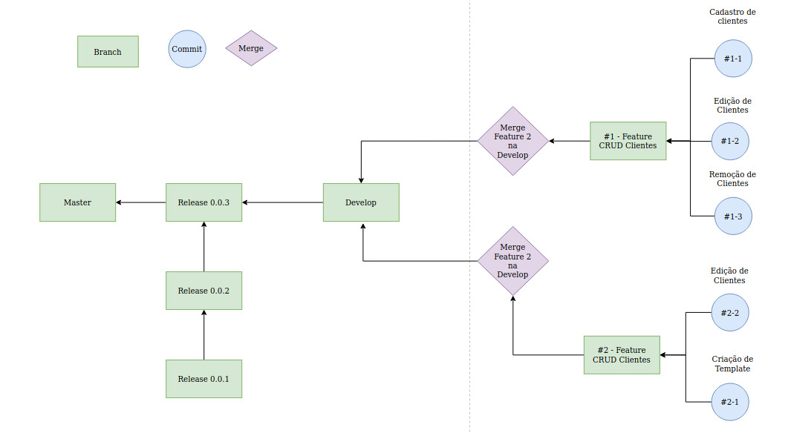

# Git4Noobs

Aula de Git de um jeito simples ao profissional para iniciantes.

## 1. Sobre o projeto

A ideia é ensinar para os usuários iniciantes que o Git não é nenhum "monstro" de se aprender e também ensinar como usar num ambiente onde há mais de um desenvolvedor atuando no projeto sem desorganizar ou perder algum traço de código no processo.

## 2. Pré-requisitos

Bom, só precisamos que você tenha o Git instalado na sua máquina. Aqui vai como você pode baixar:

- ### 2.1 Linux (Base Debian)
  Apenas execute o comando abaixo no seu terminal e a magica vai estar feita:
  ```
  sudo apt install git
  ```
- ### 2.2 Windows
  Vá até o site [Git SCM](https://git-scm.com/downloads) e faça download da versão mais atualizada e siga os passos do instalador.<br>
  Ao terminar o download você terá o app Git Bash instalado no seu Windows pronto para uso.

## 3. O que é git?

### 3.1 Primeiro Exemplo

Git é um sistema de controle de versão de arquivos. Através deles podemos desenvolver projetos na qual diversas pessoas podem contribuir simultaneamente no mesmo, editando e criando novos arquivos e permitindo que os mesmos possam existir sem o risco de suas alterações serem sobrescritas.

### 3.2 Segundo Exemplo

Git é um sistema de controle de versões distribuído, usado principalmente no desenvolvimento de software, mas pode ser usado para registrar o histórico de edições de qualquer tipo de arquivo. Cada diretório de trabalho do Git é um repositório com um histórico completo e habilidade total de acompanhamento das revisões, não dependente de acesso a uma rede ou a um servidor central.

## 4. Conceitos e Comandos

### 4.1 - Repositório

Simplificado: _Pasta do Projeto_ <br><br>
Isso ai mesmo que você está lendo. Repositório é a pasta raiz do seu projeto e não é nenhum tipo de item mágico lvl 99 que você só consegue depois de zerar algum jogo.<br><br>
Crie uma pasta vazia e digite o comando **git init**:

```
$ mkdir git4noobs
$ cd git4noobs
$ git init
Initialized empty Git repository in ~/git4noobs/.git/
```

Simples, não é mesmo?!

### 4.2 - Commit

Simplificado: _Registro de um diário_ <br><br>
Um dos problemas mais mundanos no desenvolvimento de software, é que com o dado tempo de um projeto em andamento, as pessoas começam a esquecer o quê e o porquê estão fazendo aquilo.
Enquanto você trabalha em um projeto, você pode editar e salvar arquivos no seu repositório quantas vezes você quiser. E em certo ponto, você decidir **commitar** suas alterações para o seu repositório.

Vamos dar um exemplo abaixo (no CLI e exemplo visual):

- Crie um arquivo na raiz do seu projeto (Repositório) chamado index.html e adicione algum conteúdo a ele
- Logo após adicione o arquivo criado a lista de alterações com o comando git add nomearquivo
- Crie um novo registro (commit) repositório

```
echo "Hello Rocket Devs" > index.html
git add index.html
git commit -m "inserção de index.html"
```


Em um certo ponto, você percebe que cometeu algum erro ao subir essa alteração no seu projeto. Agora você tem duas opções: reverter ou sobrescrever.<br>
Nesse caso, iremos sobrescrever a alteração para manter o registro anterior no nosso repositório com os passos abaixo:

- Altere o texto da sua index.html para "Hello He4rt Devs"
- Salve o arquivo e adicione a lista de alterações com o comand git add nomearquivo
- Crie um novo registro (commit) no seu repositório com uma descrição usando o comando git commit -m "alteração index.html"

```
echo "Hello He4rt Devs" > index.html
git add index.html
git commit -m "alteração de index.html"
```


Após fazer a alteração, podemos ver que foi adicionado outro registro em nosso repositório, uma nova entrada na qual está marcada as alterações mais recentes e com os registros anteriores guardados e documentados igualmente.

Um commit significa a adição/alteração/remoção de um ou mais arquivos dentro do seu repositório.

### 4.3 - Branch

Simplificado: _Universo Paralelo_ <br><br>
Podemos dizer que a branch é um universo ou uma realidade alternativa onde em algum ponto irá se juntar com a realidade principal. Achou esse exemplo estranho? Então deixa eu te mostrar uns exemplos.<br><br>
Pense em um cenário onde seu time encontra um problema que precisa ser resolvido, porém nem sempre há apenas uma única solução para finalizar essa tarefa, certo? É ai que a branch entra para ajudar nessa organização entre os devs.<br>
Continuando nesse cenário hipotético, os desenvolvedores irão criar uma nova vertente do código partindo da branch **master** (branch princial gerada a partir do primeiro commit), assim criando a branch implementacao-css.

A tarefa hipotética é: implementar uma regra CSS especifica na nossa index.html.

Porém, antes precisamos criar uma nova branch e para isso iremos usar o comando **git checkout** com o primeiro argumento **-b (branch)** e o segundo sendo o nome da nova branch.

```
$ git checkout -b implementacao-css
Switched to a new branch 'implementacao-css'
$ git branch
  master
* implementacao-css
```



Podemos ver que agora estamos em um outro universo diferente do principal (master) e toda e qualquer alteração feita nessa nova branch não afetará nenhuma outra dentro do projeto.<br><br>
Tá, mas o que eu faço com essa branch? A ideia é você ter liberdade para criar coisas novas sem alterar onde está tudo funcionando (master).<br>
Vamos fazer algumas alterações no nosso projeto dentro dessa nova branch:

- Crie um novo arquivo na raiz do projeto chamado main.css
- Commite esse arquivo com a mensagem "criação de arquivo main.css"

```
$ touch main.css
$ git add main.css
$ git commit -m "criação de arquivo main.css"
[implementacao-css f56f97a] criando arquivo main.css
 1 file changed, 0 insertions(+), 0 deletions(-)
 create mode 100644 main.css
```

Após isso iremos fazer outro commit para adicionar uma regra css simples a esse arquivo. Apenas entre no arquivo criado e adicione alguma regra a tag body:

```css
/*
   Arquivo: ./main.css
*/
body {
  background-color: mediumpurple;
  color: white;
}
```

Salve o arquivo arquivo alterado com os mesmos comandos feitos anteriormente e faça mais um commit:

```
$ git add main.css
$ git commit -m "adicionando regras para o main.css"
[implementacao-css ab4a625] adicionando regras para o main.css
 1 file changed, 5 insertions(+)
```

Podemos ver na imagem abaixo que há duas linhas de tempo diferentes que não se conflitaram (até momento) e podem ser alteradas ninguém atropelar o código de nenhum dos outros desenvolvedores do projeto, evitando conflitos e sempre mantendo tudo que é feito documentado dentro do repositório.



### 4.4 - Merge

Simplificado: _Fusão de duas branches_ <br><br>
Quando algum desenvolvedor falar de **merge**, quer dizer que houve uma fusão ou junção de códigos em uma única branch. Tá, mas como assim?<br>
Vamos continuar na nossa situação hipotética dos commits acima, já que temos duas branches nesse repositório. Iremos criar um merge da branch **implementacao-css** para a branch **master**. Em outras palavras, vamos juntar todas as alterações feitas na branch **implementacao-css** dentro da branch **master**, mantendo a nossa master com todo o conteúdo.

```
$ git checkout master
$ git merge implementacao-css
Updating 9b61048..ab4a625
Fast-forward
 main.css | 5 +++++
 1 file changed, 5 insertions(+)
 create mode 100644 main.css
```



Podemos ver que a master agora possui as funcionalidades da implementação-css sem precisar mexer em nada relacionado a ela, e em questão de organização você sabe onde e quando foi feito as alterações.

### 4.5 - Status

Um comando simples para saber qual branch vocẽ se encontra, quais arquivos foram alterados e também quais arquivos já estão prontos para serem commitados, é o **"git status"**. Apenas execute o mesmo depois de fazer qualquer alteração e você irá ver algum retorno parecido com o exemplo abaixo:

```
$ git status
No ramo master
Mudanças a serem submetidas:
  (use "git reset HEAD <file>..." to unstage)
	modified:   main.css
Arquivos não monitorados:
  (utilize "git add <arquivo>..." para incluir o que será submetido)
	index.html
```

Esse comando vai te dar uma visão geral de tudo que está acontecendo no repositório que vá afetar algo ou não no seu próximo commit.

### 4.6 - Diff

Passamos por todo esse processo de criar commits, entender branches e creio que tenha ficado bem claro que há um fluxo a ser seguido. Mas como vamos saber o que exatamente foi alterado nos arquivos?<br>
O comando **git diff nomearquivo.ext** consegue resolver esse problema e para entendermos melhor, iremos fazer algumas alterações no nosso projeto:

- Altere o arquivo **main.css** adicionando e editando as linhas descritas abaixo;
- Utilize o comando **"git diff main.css"** para ver as alterações criadas.

```css
/*
   Arquivo: ./main.css
*/
body {
  background-color: mediumpurple;
  color: red;
}
p {
  color: blue;
}
```

```
$ git diff main.css
diff --git a/main.css b/main.css
index 85d348e..2cfe522 100644
--- a/main.css
+++ b/main.css
@@ -1,4 +1,8 @@
 body{
     background-color:mediumpurple;
-    color:white;
+    color:red;
+}
+
+p{
+    color:blue;
 }
```

Agora vamos para uma breve interpretação do retorno acima:

- Ele está comparando com o último commit feito no mesmo arquivo;
- O sinal "+" significa tudo que foi ADICIONDO ao documento;
- O sinal "-" significa tudo que foi REMOVIDO do document.

Uma coisa interessante de saber é que se você adicionar o arquivo com o **"git add"** e tentar usar o **"git diff"** no mesmo arquivo, você não verá as alterações pois elas já estão prontas para serem commitadas.

## 5 - Gitflow

### 5.1 O que é Git Flow

Gitflow ou também conhecido como Git Workflow é uma ideia abstrata de como organizar suas branches para ter um controle maior sobre o que é feito dentro do seu projeto.<br>
Pense o seguinte cenário: sua empresa atribuiu duas novas funcionalidades para o seu time fazer e você terá que trabalhar em algumas tarefas. Dentro desse projeto, não é permitido um iniciante mexer em nada relacionado a branch Master (principal).

### 5.2 Estrutura de um Git Flow

Quando você começa a estudar um tipo de GitFlow, a primeira coisa a se entender são as responsabilidades de cada tipo de branch.
Entenda o Gitflow como uma hierarquia a ser seguida, onde você não pode pular nenhum processo ou irá gerar algum tipo de conflito em certo ponto. <br>

Vamos analisar a lista de branches abaixo:

```
Master─────────────────────Hotfix
│
└──────Releases────────────Bugfix
       │
       └─────Develop───────Bugfix
             │
             └─────Features
                   │
                   └───────Tasks
```

Podemos ver as branches em cascata, que sempre parte de uma tarefa e vai subindo gradualmente até chegar na branch princial (master). Tá, mas o que quer dizer cada uma dessas branchs? Segue a função de cada branch abaixo:

- Master - branch responsável pelo ambiente que roda em Produção

- Hotfix(es) - responsável por corrigir algum erro critico que impeça o cliente de executar alguma função em ambiente de produção.

- Releases - responsável por gerenciar e documentar todas as alterações feitas a cada deploy

- Bugfix(es) - responsável por corrigir bugs pequenos em ambiente de desenvolvimento (develop) ou homologação (release).

- Develop - branch onde sempre será criada e/ou mergeadas novas features

- Features - branchs responsáveis por desenvolver estórias do projeto

- Tasks - branch relacioada a uma feature (estória) descrevendo sempre um objetivo a ser trabalhado

Seguindo o projeto com esse fluxo, há maiores garantias que ninguém no time irá atropelar ou perder código em merges falhos onde haverão conflitos.

### 5.3 Releases

O que é uma release? Release é o compilado de alterações feitas no sistema onde é atribuido uma tag de versionamento. Quando aparecem os numeros "1.2.15" em softwares, geralmente cada um desses digitos quer te dizer algo.

- O primeiro digito é para o breaking change release, mais conhecido como que altera toda estrutura do projeto.
- O segundo digito será para releases de projeto (compilado de novas features)
- O terceiro digito será para correlão de bugfixes e alterações não agendadas referentes a release.

Quando é lançado um sistema pela primeira vez, é dado como versão 1.0.0 e a cada deploy de novas features é incrementado o segundo digito. Exemplo fictício abaixo:

```
Release: 1.2.0 (Release)
- Sistema de comentários nos posts de blog
- Sistema de comentário para usuários anonimos
- Alterações no fluxo de cadastro
Release: 1.1.2 (Bugfix)
- Correção de conflito de usuários com posts
Release: 1.1.1 (Bugfix)
- Correção de comentários duplicados em posts
Release: 1.1.0 (Release)
- Correções de bugs relacionado a login de novos dispositivos
- Sistema de Blog para usuário
Release: 1.0.0 (Breaking Change)
- Lançamento do sistema
```

### 5.4 Exemplos de GitFlow

Com um exemplo prático iremos montar o Gitflow com as tarefas abaixo num ambiente que já existe algumas releases e todo ambiente já preparado. Seguem as tarefas desse projeto fictício:

#### Funcionalidades e Tarefas

1. CRUD de Clientes
   1. Cadastro de clientes
   1. Edição de Clientes
   1. Remoção de Clientes
2. Painel de Controle (Dashboard)

   1. Criação de template
   1. Integração de API's

Temos as tarefas e funcionalidades acima listadas, agora vamos entender como elas ficariam quando tiverem sido "finalizadas" seguindo o nosso GitFlow.



## 6. Conclusão

Git de fato não é algo problemático de se trabalhar se vocẽ souber o que e quando usar. É de longe uma das melhores ferramentas de versionamento existeste nos dias de hoje e é FUNDAMENTAL para todos os desenvolvedores entenderem e refinarem o processo do GitFlow.

O exemplo do GitFlow dado acima é apenas um de muitos existentes. Logo, você também pode chegar num consenso com sua equipe e criar o seu próprio. Afinal, reinventar a roda não me parece algo tão ruim, certo?!

## x. Materiais utilizados

- [Wikipedia](https://pt.wikipedia.org/wiki/Git) - Git
- [Tableless](https://tableless.com.br/tudo-que-voce-queria-saber-sobre-git-e-github-mas-tinha-vergonha-de-perguntar/) - Tudo que você queria saber sobre Git e GitHub, mas tinha vergonha de perguntar
- [Medium](https://medium.com/faun/learn-git-in-13-words-part-1-of-3-45e83db145fd) - Aprenda Git em 13 palavras (Inglês)

## Autores

- **Daniel Reis (danielhe4rt)** - _Back-end Developer && He4rt Developers Leader_ - [Portfólio](https://danielheart.dev) - [Twitter](https://twitter.com/danielhe4rt)

## License

Este projeto está livre para ser utilizado e apresentado, apenas peço que deixe os créditos.
