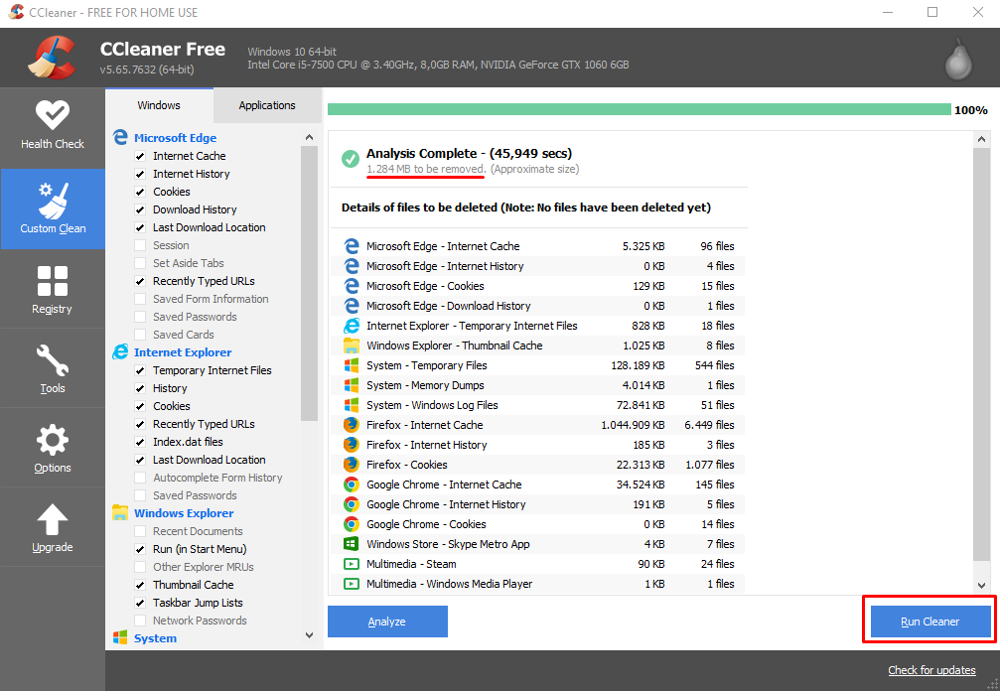
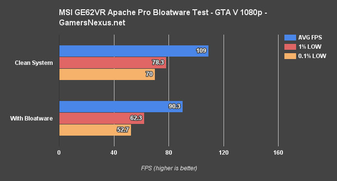

 <h1>Manutenção no Windows</h1>

<h5 style="margin-left:25px">1.0 - Verificação de Disco Rígido</h5>

A verificação de Disco Rígido serve para certificar de que o Disco e o
Windows estão funcionando perfeitamente, visto que problemas no disco
rígido são as principais causas de lentidão no sistema operacional

Essa verificação pode demorar algumas horas e em hipótese alguma deve
ser interrompida pois pode causar sérios problemas em seu disco ou
sistema. Caso use notebook, certifique-se de que ele esteja conectado da
tomada e carregando.

Primeiro passo seria executar o Check Disk, é um programa do próprio
Windows que verifica se o Disco Rígido do seu computador está
funcionando perfeitamente.

Para rodar o programa, caso você esteja no WINDOWS 10, clique com o
botão direito do mouse no menu inciar do Windows e clique em "Windows
PowerShell (Admin)".

Caso você utilize Windows 7, clique no
iniciar, pesquise por 'cmd' e clique com o botão direito e execute como
Administrador.

Feito isso, você digita 'chkdsk /r' e aperte Enter, depois disso irá
aparecer uma mensagem perguntando se você quer executar essa análise
quando o sistema for reiniciado, você digita 's' de sim ou 'y' de yes
caso seu sistema esteja em inglês.

Reinicie seu computador e o Check Disk irá carregar antes do sistema for
carregado.

OBS: Essa etapa como dito antes, pode demorar MUITO, horas, e é de
extrema importância não interromper esse processo.

É normal também durante o processo, ficar muito tempo parado entre 10% à
13%, então não ache que travou.

Também recomendo que baixe este software para verificar a saúde do seu
HD, se o resultado estiver em vermelho, seu HD está perto da morte e
deve ser trocado com urgência.

Link:[[https://crystalmark.info/en/software/crystaldiskinfo/]](https://crystalmark.info/en/software/crystaldiskinfo/)

Baixe a versão Standard Edition.

<h5 style="margin-left:25px">1.1 Corrigindo arquivos do Windows</h5>

Abra novamente o Windows PowerShell e execute o comando 'sfc /scannow',
esse comando verifica e repara arquivos protegidos do Windows e demora
certa de 20-30 minutos.

Ainda na mesma janela, porem isso funciona apenas para Windows 8 e 10,
execute o comando 'dism /online /cleanup-image /restorehealth' e tecle
enter.

Esse comando repara e restaura arquivos corrompidos ou ausentes do
sistema operacional e demora cerca de 20-40 minutos.

<h5 style="margin-left:25px">1.2 Limpeza de disco do Windows</h5>

Para fazer a limpeza inicial de disco, pode ser usada um programa do
próprio Windows, para iso, pesquise por Limpeza de Disco no barra de
pesquisa.

Dentro dele, caso você tenha diversos
discos, escolha a opção onde o Windows está instalado, para saber isso,
basta olhar na figura de disco de cada opção, a correta terá o ícone do
Windows, depois disso, clique em "Limpar Arquivos do Sistema" e escolha
novamente o disco que deve ser limpo.

Depois, clique em 'Mais opções' e escolha a segunda opção, "Restauração
de Sombras e Cópias..." aparecerá talvez uma janela, você clique em
Excluir e aguarde, depois disso, volte para a Limpeza de Disco, aqui é
importante prestar atenção, caso você tenha recentemente baixado uma
nova versão do windows, ou seja, tenha atualizado seu computador, a
versão antiga do Windows estará ainda no seu HD, com essa limpeza você
irá remover a possibilidade de voltar para antes de atualização,
atente-se também quando for marcar a pasta Download, muitas vezes podem
ter arquivos que você não queira deletar, tirando essas duas opções que
são opcionais, pode marcar todas as outras.

Agora vamos instalar o Ccleaner para fazer uma limpeza mais específica
no Windows, para isso acesse o link
[[https://www.ccleaner.com/pt-br/ccleaner/download]]
e escolha a opção de CCleaner.com e o download vai iniciar
automaticamente, depois disso, pode abrir o instalador e desmarcar
qualquer opção de instalação de softwares adicionais que normalmente
ficam na parte marcada na foto.

Depois disso, clique em 'Install' e
aguarde.

Caso apareça uma tela como essa:  

  

Clique em Decline, após isso, a instalação
vai terminar e você pode desmarcar a caixinha de "View release notes" e
clicar em run ccleaner.

Feche qualquer propaganda ou mensagem que aparecer dentro do software e
vá para "Custom Clean" e clique em Analyze e aguarde.

Quando finalizado, clique em 'Run Cleaner'

  

Após isso, você pode escolher manter ou
não o Ccleaner em seu computador, podendo desinstalar ele sem problemas.

<h5 style="margin-left:25px">1.3 Remoção de malwares, bloatwares, adwares e PUP</h5>

Bloatwares é o nome dado os programas que são pré instalados no
computador, isso ocorre para que os fabricantes de computadores ganhe
mais dinheiro por venda, e na maioria das vezes, esses programas são
inúteis e ficam sempre em segundo plano ao ligar o computador,
consumindo mais memória e deixando seu computador lento.

Nessa imagem, temos dois testes, onde o
primeiro mostra o desempenho em games com o computador limpo, sem os
softwares que acompanham o sistema.

Em baixo, temos um sistema com bloatware, onde a perda de desempenho da
máquina se torna notável, o pc com bloatware, foi 40% mais lento que o
sem.

Para remover o bloatware, basta instalar o 'pcdecrapifier', na página
oficial(essa:http://www.pcdecrapifier.com/ ), caso haja qualquer
problema com o link em questão, pode ser baixado por aqui
([[https://www.bleepingcomputer.com/download/pc-decrapifier/]](https://www.bleepingcomputer.com/download/pc-decrapifier/))
e baixe a versão gratuita, execute e clique em analyse, ele vai te
mostrar a lista dos programas que devem ser removidos, então basta
clicar em remover, atente-se caso haja algum software que você use.

Para remover os PUP, que são 'Programas potencialmente indesejados', que
seriam os programas que vem juntamente com outro software, quando você
sai clicando em Next sem ler.

Para remover esses PUP's, baixe o programa 'adwcleaner' execute, clique
em Concordo e clique em Analisar, depois disso ele fará a varredura, se
achar algo, ele vai remover e pedir para reiniciar o computador, quando
seu computador ligar novamente, entre no Painel de Controle e remove
qualquer software da Iobit, Baiudu, Ashampoo e Glarysoft, isso em nomes
do Fabricante, desinstale também qualquer software que tem Speed,
Optimizer ou TuneUP no nome.

É preciso entender que o Windows NÃO precisa de programas cuidado de
monitorando o que ele faz, esse tipo de software apenas atrapalha o
funcionamento do seu computador causando lentidão, e existem alguns que
ainda coletam seus dados de uso dentro do computador para usar com
Marketing posteriormente, te oferecendo produtos que ele sabe que você
gosta baseado em sua navegação.

OBS: o adwcleaner também remove adwares.

É importante entender que um Antivírus não funciona contra tudo 100%, e
ferramentas de varredura são muito importantes, pois elas podem ser
removidas após o uso e com certeza será muito eficiente.

A vantagem de varredura online, é que ela pode ser executa sem remover o
seu Antivírus, e caso ache uma quantidade grande de arquivos maliciosos,
já fica claro que seu antivírus não presta.

O primeiro programa para fazer essa varredura é o Panda Cloud
Cleaner([[https://www.pandasecurity.com/pt/homeusers/solutions/cloud-cleaner/]](https://www.pandasecurity.com/pt/homeusers/solutions/cloud-cleaner/)),
para instalar ele, execute, clique em Sim caso pergunte se deseja
executar o programa, clica em Next, Next e Finish e ele será executado,
clique no botão 'Accept and Scan' ou qualquer outro nme que remeta ao
início da varredura, no final, ele dará todos os resultados e as ameaças
encontradas, feche todas as janelas do seu navegador e clique em Clean.
Pode fechar a janela e confirme que quer sair, após isso, você pode
remover sem problemas o Panda Cloud, basta abrir seu painel de controle,
clicar para Desinstalar algum programa e então selecione ele.

A segunda opção, é o TrendMicro
HouseCall([[https://www.trendmicro.com/en\_us/forHome/products/housecall.html]](https://www.trendmicro.com/en_us/forHome/products/housecall.html)),
basta selecionar a opção referente ao seu sistema e execute o programa,
ele vai baixar as últimas atualizações de malware, depois você diz que
aceita os termos de contrato 'i ACCEPT', e clique em Next.

Com o programa aberto, clique em 'settings' e selecione 'Full sustem
scan' e clique em Ok, depois pode clicar em Scan Now para iniciar a
varredura, no final clique em Fix Now.

A terceira opção de varredura, é a eset online scanner, você também
acessa a página oficial do
produto([[https://www.eset.com/br/antivirus-domestico/online-scanner/]](https://www.eset.com/br/antivirus-domestico/online-scanner/)),
clique em escaneamento único e instale, ao abrir, você marca a opção 'Eu
aceito', clique que não que enviar nenhum dado anonimo nem feedback, ele
te retornará uma página com quarto opções, selecione a Escanear o
computador, após abrir outra página, selecione Escaneamento completo,
após isso, marque a caixa 'Ative a solução para detectar e colocar...' e
clique em Iniciar escaneamento, ele fará o Download do banco de dados,
espere, após isso, ele começa o rastreamento de softwares maliciosos.

No final, pode apenas confirmar remover as ameaças, que seria 'Remover
arquivos da quarentena', depois isso pode remover ele da sua pasta de
download.
