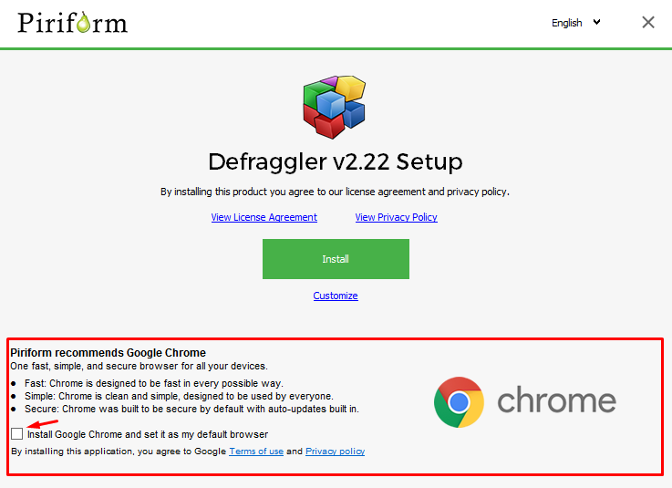
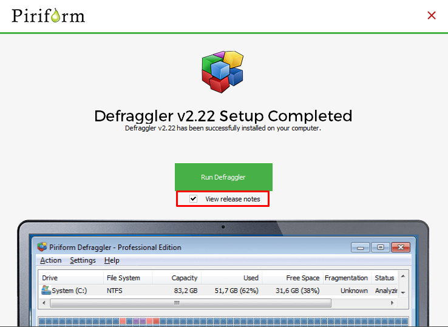
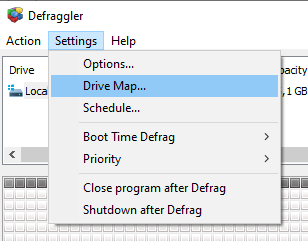
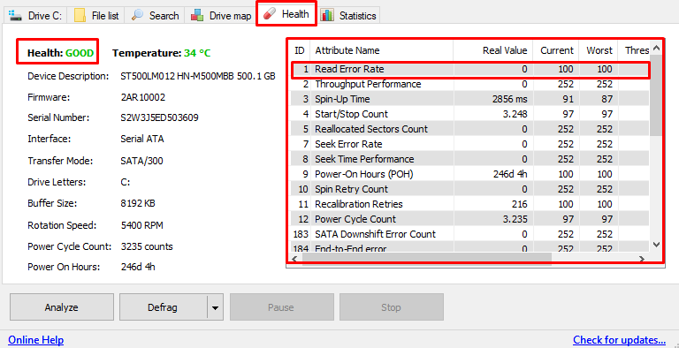
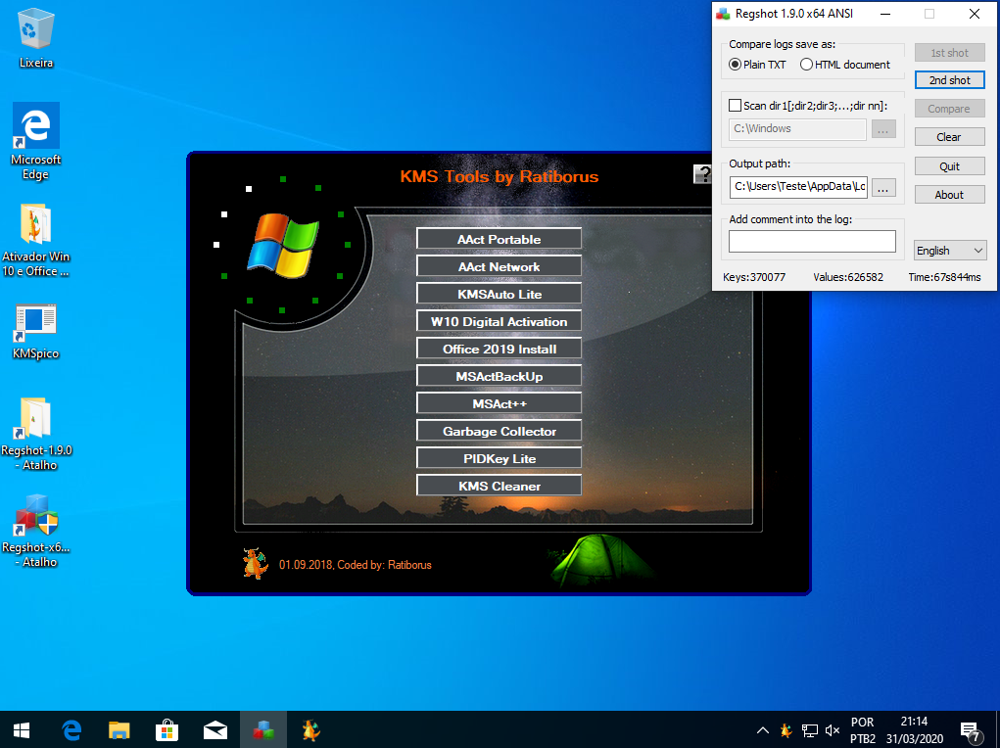

<h1>Otimização no Windows</h1>

<h5 style="margin-left:25px">2.0 Desfragmentação de Hds e SSDs</h5>

Primeiramente é importante entender o que é um arquivo fragmentado. Ao
se salvar um arquivo, ele sempre é salvo em pequenas partes, caso haja o
espaço livre contínuo, ele salvará com blocos sequenciais(como bloco
1,2,3,4,5) uma após a outra.

Caso não haja espaço para deixar de forma sequencial, o arquivo se torna
fragmentado, e sempre que você for abrir esse arquivo, o seu HD terá que
rodar o pino até localizar todos os pontos desse arquivo fragmentado
pelo seu disco rígido, o que causa uma grande lentidão, quando lidos e
quando salvos.

Quando há uma desfragmentação, você consegue deixar esses arquivos de
forma sequencial, fazendo com que a leitura e procura deles seja de
forma rápida.

Para desfragmentar seu disco rígido, basta acessar o site
[[https://www.ccleaner.com/defraggler]{.underline}](https://www.ccleaner.com/defraggler)
e baixe o programa pelo link do Ccleaner.

Ao executar o programa, certifique-se de ter desmarcado qualquer caixa
de software adicional

Após isso, pode clicar em 'Install', no final, retornará essa janela

  

DESMARQUE essa caixinha e clique em Run
Defraggler

Agora com ele aberto, vamos configurar, clique em Setings ou Opções →
Mapa do dispositivo(Drive Map).

Depois, clique em Visão customizada ou Custom View, escolha 12x12,
estilo Plano e modo Barras, clique em Ok.

Clique novamente em Opções, Opções novamente e clique em desfragmentar,
nessa janela, marque a caixinha e digite '1000'(mil) e clique em Ok

Depois vá até a página Saúde ou Health e verifique os seguintes dados

  

Caso onde está escrito Good(Bom), esteja
escrito outra coisa em amarelo ou vermelho, seu HD certamente está com
um problema, e na área grande em vermelho, caso qualquer uma das linhas
esteja vermelha, é risco total e seu recomendo que faça backups de seus
dados pois seu HD pode parar a qualquer momento.

Agora vá em Opções novamente, deixe o mouse sobre 'Boot time defrag' ou
Desfragmentação na inicialização, selecione 'Executar uma vez' e depois
na janela que vai aparecer clique em Não, dessa forma, a próxima
inicialização do computador, será rodado o desfragmentador para os
arquivos que o programa não pode mexer enquanto o windows trabalha.

Após isso, clique em Desfragmentar ou Defrag no canto inferior esquerdo

Caso aparece Otimizar, significa que você está usando um SSD, clique na
setinha ao lado e escolha Desfragmentar e clique em Sim(Yes) na janela
que irá aparecer e a desfragmentação inicializará.

Seja paciente, pois pode demorar algumas horas e recomendo que deixe o
seu notebook na tomada durante o processo, e não faça NADA no computador
durante o processo, deixe ele sozinho com nada executando de fundo
rodando.

Existem diversos "técnicos" na internet alegando que é RUIM e
PREJUDICIAL a desfragmentação em SSDs, pois essa informação está ERRADA,
mesmo que em maioria das vezes seja desnecessário, a desfragmentação do
mesmo NÃO estraga seu SSD nem deixa ele com mal funcionamento ou
qualquer outra coisa do tipo.

O que ocorre é uma grande desinformação, pois pessoas que são leigas no
assunto insistem em "ajudar" a comunidade com dicas falsas que não valem
de nada.

<h5 style="margin-left:25px">2.1 Dicas para windows rápido</h5>

Manter Windows Update atualizado

Mantenha sempre o antivirus atualizado

A cada 15 dias execute uma limpeza com o Ccleaner e com o Defraggler

Cuidado com extensões de navegadores pois muitas delas podem danificar
seu computador

Seja crítico e não acredite que em tudo que você ver, não existe nada
milagroso na internet

Se você tem um computador antigo, NÃO instale otimizadores, eles vão
apenas prejudicar o seu PC, ao inves isso, compre um SSD

Recuse qualquer programa que prometa otimizar seu computador e deixar
ele 10x mais rápido ou qualquer outra coisa do tipo

Evite ao máximo usar cracks e ativadores.

<h5 style="margin-left:25px">2.2 Registro do Windows</h5>

O registro do windows é uma das partes mais importantes do sistema, nela
contém mais de 2 milhões e meio de chaves únicas, ou seja, mais de 2
milhões de configurações do Windows e de softwares nele instalado

O registro pode ser acesso rodando o comando 'regedit' no 'Executar',
mas eu obviamente não recomendo isso, pode deve ser modificado somente
por quem sabe exatamente o que está fazendo, pois qualquer alteração
pode corromper seu S.O

O registro do Windows é composto de 5 importantes arquivos, que ficam
localizados na pasta

C\>Windows\>System32\>config

Os 5 arquivos são:

SAM

Ele guarda informações sobra a conta dos usuários

Security

Armazena informações especificas sobre segurança

Software

Tem informações sobre programas instalados

System

Armazena as configurações do computador

Default

Armazena configurações padrões usadas por serviços e programas
instalados no Windows

Essas informações são carregas na inicialização do Windows, e por isso,
quando feito uma alteração, precisa reiniciar o computador.

Muitos programas como Ccleaner entre outros tem a opção de limpar o
registro, o que é enormemente desnecessário e um grande erro, pois isso
além de não mudar nada no desempenho, pode vir a causar problemas.

Entenda, que o define o sistema, são as CONFIGURAÇÕES dessas chaves, e
não a QUANTIDADE delas, então sair deletado tais chaves ou usando
softwares para o mesmo são muda nada e ainda pode te causar problemas. O
Windows carrega todas as chaves, mais de 2 milhoes, essas são carregas
em menos de 5s pelo windows, remover 5, 500, 50000, ou 100.000 chaves
não vai mudar absolutamente nada.

<h5 style="margin-left:25px">2.3 Mostrando na prática como os ativadores corrompem o Windows</h5>

Para isso, eu baixei uma ISO oficial pelo próprio site da Microsoft,
para isso, usei a ferramenta que ela proporciona nesse link:
[https://www.microsoft.com/pt-br/software-download/windows10]

Após o Download da ferramenta, fiz a geração da ISO configurada para 64x
e prossegui normalmente.

Após isso, instalei o Windows em uma máquina virtual e fiz a instalação
normal com tudo que a própria Microsoft me recomendava, e não conectei
minha conta Microsoft na instalação do Windows.

Quando instalado, fui nas configurações e pedi para que o Windows
procurasse as atualizações, no final, eu tinha um Windows atualizado,
versão PRO na qual eu escolhi durante a instalação, após isso, eu
desliguei a rede do Windows para que não haja nenhuma alteração em
atualizações em segundo plano e coloquei dois ativadores principais que
a maioria as pessoas usam para o processo, que são KMSPico e KMSTools.
Com os arquivos salvos, eu desliguei a máquina e criei uma Snapshot,
para quando eu fizer o teste com um dos ativadores, eu possa voltar no
windows anterior e a análise seja justa com ambientes iguais.

Para coletar as alterações feitas no registro e no Windows, eu usei o
Regshot.

A configuração da máquina virtual é a seguinte:

E o Windows não está ativado.

Para começar os testes, iniciei o Regshot, tirei a primeira shot do
sistema e executei o KMS Tools, escolhi a opção W10 Digital Activation e
aguardei finalizar a ativação

Após. Eu rodei o 2nd shot e fiz a opção de Comparar.

Nesse ativador, tivemos um total de 334 alterações no registro do
Windows, foram essas:

<ul>
<li>3 Keys deletadas</li>

<li>51 Keys adicionadas</li>

<li>5 Values deletados</li>

<li>108 Values adicionados</li>

<li>167 Values modificados</li>
</ul>

<b>No KMS Pico, o valor foi ainda pior</b>
<ul>
<li>24668 Values adicionados</li>

<li>42 Keys adicionadas</li>

<li>2 keys deletadas</li>

<li>114 Values deletadas</li>

<li>233 values modificados</li>
</ul>
Fica evidente, dessa forma, que o Windows termina completamente
diferente do que ele deveria ser e feito para trabalhar, com essas
modificações, o sistema ficará extremamente instável, tendo diversas
telas azuis e erros aleatórios.
