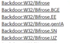

<h1>Segurança no Windows</h1>

<h5 style="margin-left:25px">3.0 Proteção dentro do navegador</h5>

Para manter o navegador seguro, é fundamental você ter um bloqueador de
propagandas e um analisador de URL, além do BlockAD, bloquear obviamente
banners, ele tambem bloqueia códigos maliciosos, e ao contrário do que é
propagado na internet, esses códigos podem estar em QUALQUER site, não
somente em sites porno ou download pirata, então, SIM, é possível ser
infectado apenas acessando um site.

Mas como isso funciona?

As propagandas dificilmente são criadas pelo próprio site, esses banners
estão rodando em servidores de empresas de publicidade, que podem estar
espalhadas pelo mundo todo, e se um desses servidores for invadido,
dessa forma, ele pode injetar códigos nesses banners e eles irem para
TODOS os sites que contém esse anúncio, como Youtube, sites de notícia e
afins.

Esse ataque é nominado Malvertising e desde 2015 isso ocorre.

O bloqueador de propagandas que eu recomendo, e é Open-Source, é o
uBlock Origins, que está disponível na maioria dos navegadores, como
Firefox, Google Chrome, Edge, Opera entre outros.

[https://chrome.google.com/webstore/detail/ublock-origin/cjpalhdlnbpafiamejdnhcphjbkeiagm?hl=pt-BR]

[https://addons.mozilla.org/pt-BR/firefox/addon/ublock-origin/]

[https://addons.opera.com/pt-br/extensions/details/ublock/]

[https://www.microsoft.com/pt-br/p/ublock-origin/9nblggh444l4?activetab=pivot:overviewtab]

Verifique, sempre, se a extensão for do Raymond Hill.

Para desabilitar ele, basta clicar no ícone que ficará no canto do seu
navegador e clique no botão azul, em seguida, recarregue a página.

Agora precisamos nos proteger do Phishing, com um bloqueador de URL, que
bloqueiam sites hackeados pelo ataque que foi dito anteriormente.

Para isso, recomendo fortemente o Traffic Light da Bitdefender,
disponível em diversos navegadores também.

[https://www.bitdefender.com.br/solutions/trafficlight.html]

Ou se preferir, pesquise por 'Traffic Light' e em seguida o nome do seu
navegador.

<h5 style="margin-left:25px">3.1 Como funcionam os antivírus e opções</h5>

Os antivírus usam tecnologias para conseguir identificar uma ameaça em
seu computador, dentre elas, existem as: Assinatura, heurística, HIPS,
nuvem e inteligencia artificial. E vamos falar de cada uma delas.

A detecção por ASSINATURA é a mais antiga e básica, onde o antivírus
procura por trechos de códigos que foram usados anteriormente por outros
malwares, pois caso há a repetição de linha de código, certamente aquele
software é malicioso.

Isso ocorre pois existem diversas formas de criarem esses malwares,
trojans e afins de forma gratuita sem precisar de níveis qualquer de
programação, possibilitando que qualquer pessoa crie.

Nesses casos, é criado a variante de um vírus, como pode ser visto nesse
caso:

Porém essa análise é falha, pois caso fosse criado um malware
desconhecido, com código fonte completamente diferente, passaria abatido
pelo antivírus, permitindo assim que o computador seja infectado.

Para isso, existe a análise HEURÍSTICA, ela procura por padrões e
características do programa, que possam indicar que seja um
comportamento malicioso, toda vez que há esse padrão, é atribuído uma
pontuação para ele, caso a soma for maior que X valor, o antivírus
determina o software em questão como malware.

Por isso, que antes mesmo de você conseguir abrir algum arquivo, ele já
foi removido do seu computador e classificado como ameaça, pois
certamente, ele foi barrado pela Assinatura ou Heurística.

Acontece que muitas vezes, provavelmente ocorreu com você alguma vez
também, o antivírus bloqueia algum software somente DEPOIS da execução,
isso se deve pelo HIPS, ele é responsável pela análise COMPORTAMENTAL
desse software, por exemplo, suponha que você execute um ransonware e
ele comece a criptografar seus arquivos, o antivírus vendo isso,
bloqueia a próxima instrução, na qual já estava carregada na memória ram
que seria de apagar seus arquivos originais, restando somente os
criptografados, dessa forma.

Além disso, existem mais duas que ainda não foram ditas, PROTEÇÃO NA
NUVEM e INTELIGENCIA ARTIFICIAL, mas como funciona?

A PROTEÇÃO NA NUVEM, funciona de forma bem interessante, suponha que
você execute um malware nunca antes visto, mas seu antivírus considera
ele suspeito baseado nas análises que foi citadas a cima, dessa forma,
ele ENVIA esse mesmo arquivo para servidores de quarentena da empresa,
onde ele é testado rigorosamente, e caso seja classificado, que de fato
seja um programa malicioso, ele será nomeado, classificado e catalogado,
e depois seu antivírus recebe uma atualização, com as informações
atualizadas para que, caso alguém no mundo baixe esse programa, ele nem
se quer tenha a necessidade de executar esse malware, ele será removido
imediatamente, ou seja, dessa forma, caso haja um único infectado no
mundo todo, em poucos segundos, esse arquivo já está sendo analisado
pelos servidores e em menos de 2 ou até mesmo 1 dia, já esteja
funcionando e bloqueando o mesmo programa no mundo inteiro.

Mas onde INTELIGENCIA ARTIFICIAL entra nisso tudo?

Um grande exemplo disso, é o Windows Defender, ele usa I.A para suas
detecções, mas por que isso? Pois as empresas estão em busca de um
objetivo, que seria NUNCA errar, detectar 100% dos malwares e 0%de taxas
de falso positivos.

A I.A, é assim como nós, quanto mais praticamos e erramos, melhor
ficamos, ela precisa de uma enorme variedade softwares maliciosos ou não
para treinar sua detecção.

Toda vez que o Defender detecta um malware de algum usuário no mundo, as
informações desse malware são passadas para servidores da Microsoft, e o
que eles fazem? Eles analisam continuamente um volume gigantesco de
informações, que são providas das centenas de milhões de Windows
Defenders no mundo e lá, procuram por padrões para concluir se é ou não
malicioso.

Após isso, esse malwares é levado a outros servidores, nos quais
realizam diversos testes vendo TUDO que foi feito depois da execução
dele.

Com isso, fica CLARO, que vídeos de teste comparando antivírus não
prestam de NADA, pois ao antivírus recebem constantemente atualizações e
em menos de 1 dia, podendo aumentar consideravelmente as suas detecções.

Com tudo colocado em mesa, vamos para as recomendações. Primeiro de
tudo, não escolha nenhum antivírus que tenha essa função como tarefa
secundaria, exemplo, uma empresa que fazia algo completamente diferente
resolveu soltar um antivírus, escolha somente de empresas FOCADAS e
EXCLUSIVAMENTE em segurança digital, pois deve ser tratado com
seriedade, então, consequentemente, dispenso qualquer uso de QUALQUER
antivírus chineses e qualquer porcaria de Iobit, AVAST e AVG.

Dito isso, recomendo esses:

Windows Defender(Vem junto com o Windows 10) <storm style=color:blue>TOP</storm>

[[https://www.kaspersky.com.br]](https://www.kaspersky.com.br/) - Kaspersky <storm style=color:blue>TOP</storm>

[[https://www.pandasecurity.com]](https://www.pandasecurity.com/) - Panda

[[https://www.avira.com/pt-br]](https://www.avira.com/pt-br) - Avira

<h5 style="margin-left:25px">3.2 Tela azul da morte</h5>

A tela azul acontece quando o próprio Windows fica instável, e ao
contrário do que é acreditado, ele NÃO está travado, o erro em questão é
colocado em DUMP pela memória e depois o sistema é reiniciado, ele
apenas bloqueia qualquer interação via mouse/teclado do usuário.

A informacao mais importante da tela azul é o Stop code, mas segundo a
telemetria do Windows, 20 desses códigos são responsável por 90% dos
casos, de 300 codes.

Os mais comuns estão relacionados a memória ram, incompatibilidade e
drivers.

Recomendo que, para que se possa monitorar esses erros, você ative o
mini dump, para isso, vá para:

Abrir o Explorar de arquivos → clique com o botão direito em 'Meu
computador' e 'Propriedades' → Configurações Avançadas do Sistema →
Terceiro e último botão de Configurações(inicialização e recuperação) e
escolha a opção 'Despejo de memória pequeno (256KB) em 'Gravando
informações de depuração' clique em Ok até fechar tudo.

Para que se possa monitorar esse erro, basta baixar esse programa:

[[https://www.nirsoft.net/utils/blue\_screen\_view.html]]()

Com o programa instalado, depois de ocorrer a tela azul, basta abrir ele
e será lhe mostrado EXATAMENTE o que causou o erro(driver responsável
pelo erro).
